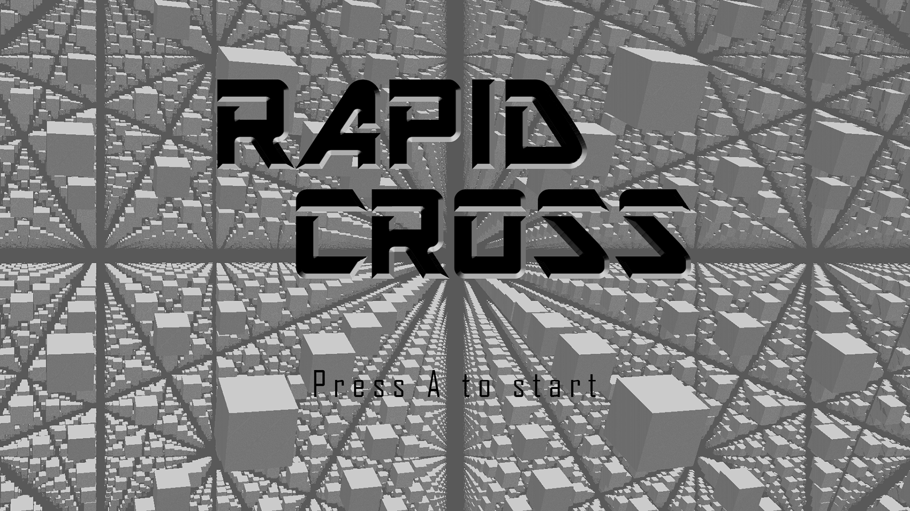
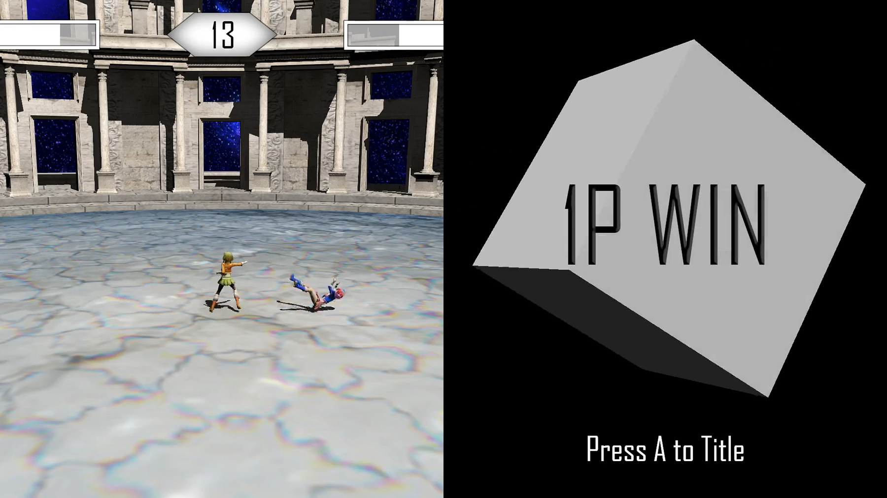

# Rapid Cross
Rapid Crossは、私が高校生の時に作った2人用の対戦型格闘ゲームです。Googleドライブの<a href="https://drive.google.com/file/d/1OAvcEqCbfUelIuhk--kcvd4Yai7DCOen/view?usp=sharing" target="_blank">Rapid Crossフォルダ</a>をダウンロードし、RapidCross.exe を実行することで一応遊べます。実行する際は必ず README.html をご一読ください。主にソースコードを公開することを目的としており、今後更新することはないかと思います。
落書き感覚のソースコードをお楽しみください。  

また、タイトル画面の背景のみWebで閲覧できます。  
[Run on Web](https://www.shadertoy.com/view/XttcRH)

  

  

## 注意事項

- EXEファイルを実行した際に起こった問題に関しては自己責任ということでお願いします。
- 動作しない、エラーが出る等の問題の対応もいたしません。
- 使用音源の一部が著作権フリーではなかった(もしくは、不明だった)ので、変更しております。クレジット画面と内容に差異がありますが、ご了承ください。詳細は下記。

<dl>
  <dt>変更前</dt>
  <dd>Made In China / Mad Scientist</dd>
  <dd>Nhelv / <a href="https://silentroom.tumblr.com">Silentroom</a></dd>
  </dd>
  <dt>変更後</dt>
  <dd>イコールゼロ / <a href="http://espergakuen.web.fc2.com">かずち</a></dd>
  <dd>Sound Wave / <a href="https://dova-s.jp/_contents/author/profile266.html">FLASH☆BEAT</a></dd>
</dl>
(敬称略)

## ライセンス
[BSD 2-Clause "Simplified" License](LICENSE)
